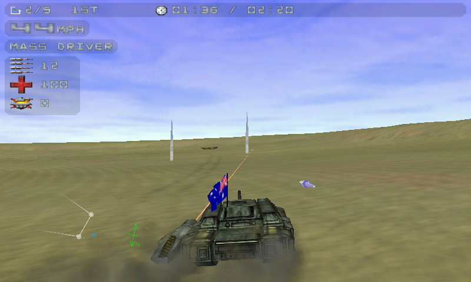

# Tread Marks

Unofficial Linux and Pandora port for the OpenSource game Candy Crisis

# Build

You will need CMake 3.6.1+, SDL2, GLEW and SFML (2.x) to build Tread Marks on Linux
Optionaly, you'll need Qt5 for the dedicated server (disabled by default)

You may need to manualy update your cmake version.

simply
`cmake && make`

# Notes

You can see the original BUILD.txt 

The 64 bits build does not works correctly. You'll need to force `-m32` in your `CXXFLAGS` and `CFLAGS` if you building on a 64bits Linux.
